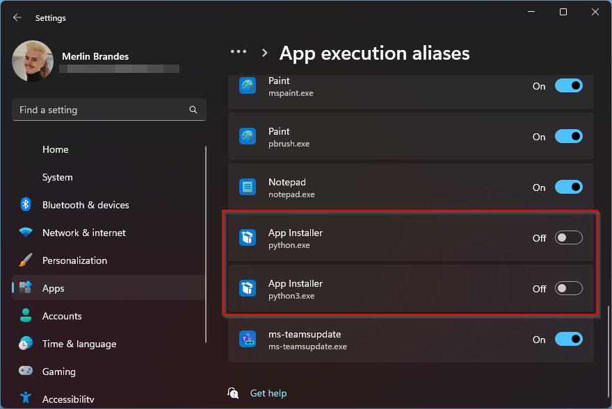

# Welcome

This is an effort to provide help and documentation for common tasks and problems around the FatalDream landscape.

For question or suggestions, please contact me on [Discord (click to open profile)](https://discord.com/users/174617873182883841) or DM me `@FatalMerlin`.

## Contributing

Damn son, you wanna help us improve the documentation? Awesome-sauce!  
  
Here's how:

### Linux
- make sure you have `python3` installed (e.g. `sudo apt install python3`)
- `python -m pip install mkdocs`
- `python -m site --user-site` find your pip installation site and add it to your PATH environment variable
- `git clone https://github.com/FatalDream/docs`
!!! warning "If you are not a collaborator, remember to make your own fork and clone that instead."
- `./install-dependencies.sh`
- `mkdocs serve` to start your local dev server and edit away!

### Windows
- before installing Python, on Windows 10 and newer:
  - [Open Settings](ms-settings:)
  - Go to Apps > Advanced app settings > App execution aliases
  - Disable the options with the title `App Installer` and description:
    - `python.exe`
    - `python3.exe`
    
- install Python 3 from here: [https://www.python.org/downloads/](https://www.python.org/downloads/)
- `python -m pip install mkdocs`
- `python -m site --user-site` find your pip installation site and add it to your PATH environment variable
- `git clone https://github.com/FatalDream/docs`
!!! warning "If you are not a collaborator, remember to make your own fork and clone that instead."
- `./Install-Dependencies.ps1`
- `mkdocs serve` to start your local dev server and edit away!